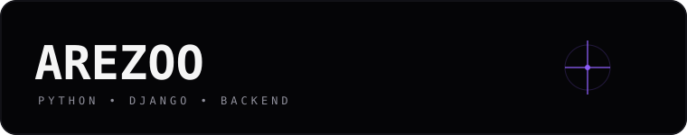

<div align="center">


<br><br>



<br><br>

<a href="https://github.com/Arezoosrad">
  
</a>
<a href="https://www.python.org/">
  
</a>
<a href="https://www.djangoproject.com/">
  
</a>

<br><br>


</div>

<div align="center"></div>

## `01 / IDENTITY`

<table>
<tr>
<td width="58%" valign="top">

### AREZOO SEDIGHIRAD

**Python / Django Backend Developer**

I build backend systems with a strong focus on:

- clear domain boundaries
- RESTful APIs
- reusable Django components
- hybrid modular architecture
- maintainable business logic
- containerized development
- practical engineering over unnecessary complexity

> **Architecture first. Code second.**

</td>
<td width="42%" valign="middle">

<div align="center">

```text
THINK
  ↓
DESIGN
  ↓
MODEL
  ↓
IMPLEMENT
  ↓
TEST
  ↓
SHIP
```

</div>

</td>
</tr>
</table>

<div align="center"></div>

## `02 / TECH STACK`

<div align="center">


<br><br>


</div>

<br>

| Layer | Technologies |
|---|---|
| **Backend** | Python · Django · Django REST Framework |
| **Async / Cache** | Celery · Redis |
| **Frontend** | HTML · CSS · Tailwind CSS |
| **DevOps** | Linux · Docker |
| **Version Control** | Git · GitHub |
| **Architecture** | Hybrid Modular Django · Separation of Concerns |

<div align="center"></div>

## `03 / ARCHITECTURE`

<div align="center">

```text
                         ┌──────────────────────┐
                         │       CLIENT         │
                         │   Browser / Frontend  │
                         └──────────┬───────────┘
                                    │
                                   HTTP
                                    │
                                    ▼
                         ┌──────────────────────┐
                         │         API          │
                         │    Django + DRF      │
                         └──────────┬───────────┘
                                    │
                                    ▼
              ┌──────────────────────────────────────────┐
              │        HYBRID MODULAR DJANGO             │
              │                                          │
              │   ┌──────────┐    ┌──────────────┐      │
              │   │  DOMAIN  │    │   DOMAIN     │      │
              │   │    A     │    │      B       │      │
              │   └────┬─────┘    └──────┬───────┘      │
              │        │                  │              │
              │   ┌────▼──────────────────▼─────┐       │
              │   │  Services / Business Logic │       │
              │   └──────────────┬──────────────┘       │
              └──────────────────┼───────────────────────┘
                                 │
                    ┌────────────▼────────────┐
                    │   DB / CACHE / WORKERS  │
                    │   Redis · Celery · DB   │
                    └─────────────────────────┘
```

</div>

**Core idea:** keep shared infrastructure centralized while keeping business domains modular and independently understandable.

<div align="center"></div>

## `04 / ENGINEERING WORKFLOW`

<div align="center">

```text
REQUIREMENTS
     ↓
USE CASE
     ↓
ENTITY / ERD
     ↓
DATABASE MODEL
     ↓
API CONTRACT
     ↓
SERVICE / BUSINESS LOGIC
     ↓
VIEW / ENDPOINT
     ↓
FRONTEND
     ↓
TEST
     ↓
DOCKER / DEPLOY
```

</div>

I prefer **understanding the system before implementing the code** — then turning the design into small, testable pieces.

<div align="center"></div>

## `05 / GITHUB ACTIVITY`

<div align="center">


<br><br>


</div>

<div align="center"></div>

## `06 / CONTRIBUTION`

<div align="center">


<br>

<sub>Consistent iterations. Small commits. Better systems.</sub>

</div>

<div align="center"></div>

## `07 / CURRENT FOCUS`

<div align="center">

```text
╭──────────────────────────────────────────────────────╮
│                                                      │
│   DJANGO BACKEND        ████████████████████         │
│   REST API              ███████████████████          │
│   MODULAR ARCHITECTURE  ██████████████████           │
│   REDIS / CELERY        ████████████████             │
│   DOCKER / LINUX        ███████████████              │
│   CLEAN ENGINEERING     ███████████████████          │
│                                                      │
╰──────────────────────────────────────────────────────╯
```

</div>

<div align="center">

### `BUILD CLEAN. THINK DEEP. SHIP BETTER.`

<br>

<a href="https://github.com/Arezoosrad">

</a>

<br><br>


</div>
