<div align="center">

<a href="https://github.com/Arezoosrad">
  
</a>

<br />


<br /><br />

<a href="https://github.com/Arezoosrad">
  
</a>
&nbsp;
<a href="https://github.com/Arezoosrad?tab=repositories">
  
</a>

</div>

---

## `01 / IDENTITY`

<div align="center">

### **AREZOO SEDIGHIRAD**

**Python / Django Backend Developer**

I build backend systems with a focus on **modularity, clear boundaries, reusable components, REST APIs and maintainable Django architecture**.

<br />

`PYTHON` · `DJANGO` · `DRF` · `REDIS` · `CELERY` · `DOCKER` · `LINUX`

</div>

---

## `02 / TECH STACK`

<div align="center">


<br /><br />


</div>

<br />

| Layer | Stack |
|:---|:---|
| **Language** | Python |
| **Backend** | Django · Django REST Framework |
| **Async / Queue** | Celery · Redis |
| **Frontend** | HTML · CSS · Tailwind CSS |
| **DevOps** | Linux · Docker |
| **Version Control** | Git · GitHub |
| **Architecture** | Hybrid Modular Django |

---

## `03 / ARCHITECTURE`

<div align="center">

```text
                         ┌──────────────────────┐
                         │       CLIENT         │
                         │  Browser / Frontend  │
                         └──────────┬───────────┘
                                    │
                                  HTTP
                                    │
                                    ▼
                         ┌──────────────────────┐
                         │       API LAYER      │
                         │ Django REST Framework│
                         └──────────┬───────────┘
                                    │
                                    ▼
        ┌──────────────────────────────────────────────────────┐
        │              HYBRID MODULAR DJANGO                   │
        │                                                      │
        │   ┌───────────┐   ┌───────────┐   ┌─────────────┐  │
        │   │   USERS   │   │ PRODUCTS  │   │   ORDERS    │  │
        │   └───────────┘   └───────────┘   └─────────────┘  │
        │                                                      │
        │   ┌───────────┐   ┌───────────┐   ┌─────────────┐  │
        │   │ SERVICES  │   │   TASKS   │   │   SHARED    │  │
        │   └───────────┘   └───────────┘   └─────────────┘  │
        │                                                      │
        └───────────────┬──────────────────┬──────────────────┘
                        │                  │
                        ▼                  ▼
               ┌────────────────┐  ┌────────────────┐
               │    DATABASE    │  │ REDIS / CELERY │
               │   Persistence  │  │ Async / Queue  │
               └────────────────┘  └────────────────┘
                                    │
                                    ▼
                              ┌────────────┐
                              │  DOCKER    │
                              │  LINUX     │
                              └────────────┘
```

</div>

> **Architecture first. Code second.**

`Modularity` · `Separation of Concerns` · `Reusability` · `Maintainability`

---

## `04 / ENGINEERING WORKFLOW`

<div align="center">

```text
REQUIREMENTS
     │
     ▼
USE CASE
     │
     ▼
DOMAIN / ENTITY
     │
     ▼
ERD / DATABASE
     │
     ▼
DJANGO MODEL
     │
     ▼
API / SERIALIZER
     │
     ▼
SERVICE / BUSINESS LOGIC
     │
     ▼
VIEW / ENDPOINT
     │
     ▼
FRONTEND
     │
     ▼
TEST → DOCKER → DEPLOY
```

</div>

I prefer understanding the system before implementing individual pieces.

**Understand → Design → Implement → Test → Ship**

---

## `05 / WHAT I BUILD`

<div align="center">

| Backend | Architecture | Infrastructure |
|:---:|:---:|:---:|
| REST APIs | Hybrid Modular Django | Docker |
| Business Logic | Separation of Concerns | Linux |
| Authentication | Reusable Components | Git / GitHub |
| Async Tasks | Domain Boundaries | Redis / Celery |

</div>

---

## `06 / GITHUB ACTIVITY`

<div align="center">


<br /><br />


</div>

---

## `07 / CONTRIBUTION FLOW`

<div align="center">


<br />

<sub>Continuous learning · Continuous building · Continuous iteration</sub>

</div>

---

## `08 / CURRENT FOCUS`

<div align="center">

```text
PYTHON BACKEND
      │
      ├── DJANGO
      ├── DJANGO REST FRAMEWORK
      ├── HYBRID MODULAR ARCHITECTURE
      ├── REDIS / CELERY
      ├── DOCKER / LINUX
      └── PRODUCTION-READY SYSTEM DESIGN
```

</div>

---

## `09 / CONNECT`

<div align="center">

<a href="https://github.com/Arezoosrad">
  
</a>

</div>

---

<div align="center">

### `BUILD CLEAN. THINK DEEP. SHIP BETTER.`

<br />


</div>
