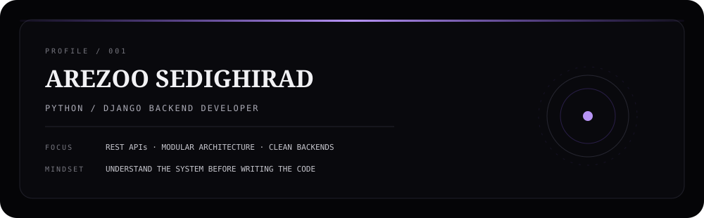
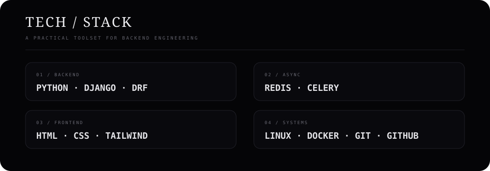

<div align="center">
  
</div>

<br>

<div align="center">
  
</div>

<br>

<div align="center">
  
</div>

<div align="center"></div>

## `01 / IDENTITY`

<div align="center">
  
</div>

<div align="center"></div>

## `02 / TECH STACK`

<div align="center">
  
</div>

<div align="center"></div>

## `03 / ARCHITECTURE`

<div align="center">

```text
                         CLIENT / FRONTEND
                                │
                               HTTP
                                ▼
                    ┌───────────────────────┐
                    │      API LAYER        │
                    │     Django + DRF      │
                    └───────────┬───────────┘
                                │
                                ▼
              ┌──────────────────────────────────┐
              │     HYBRID MODULAR DJANGO        │
              │                                  │
              │   ┌─────────┐   ┌─────────┐      │
              │   │ DOMAIN  │   │ DOMAIN  │      │
              │   │    A    │   │    B    │      │
              │   └────┬────┘   └────┬────┘      │
              │        └──────┬───────┘           │
              │               ▼                   │
              │       SERVICES / LOGIC            │
              └───────────────┬───────────────────┘
                              │
                    ┌─────────▼──────────┐
                    │ DB · REDIS · CELERY│
                    └────────────────────┘
```

</div>

> **Architecture first. Code second.**  
> Shared infrastructure stays centralized; business domains stay modular and understandable.

<div align="center"></div>

## `04 / ENGINEERING WORKFLOW`

<div align="center">

```text
REQUIREMENTS
    ↓
USE CASE
    ↓
ENTITY / ERD
    ↓
DATABASE MODEL
    ↓
API CONTRACT
    ↓
SERVICE / BUSINESS LOGIC
    ↓
VIEW / ENDPOINT
    ↓
FRONTEND
    ↓
TEST
    ↓
DOCKER / DEPLOY
```

</div>

<div align="center"></div>

## `05 / GITHUB ACTIVITY`

<div align="center">
  
  
  <br><br>
  
</div>

<div align="center"></div>

## `06 / CONTRIBUTION ANIMATION`

<div align="center">
  
  <br>
  <sub>Generated automatically by GitHub Actions.</sub>
</div>

<div align="center"></div>

## `07 / CURRENT FOCUS`

<div align="center">

```text
DJANGO BACKEND          ████████████████████
REST API                ███████████████████
MODULAR ARCHITECTURE    ██████████████████
REDIS / CELERY          ████████████████
DOCKER / LINUX          ███████████████
CLEAN ENGINEERING       ███████████████████
```

### BUILD CLEAN. THINK DEEP. SHIP BETTER.

<a href="https://github.com/Arezoosrad">
  
</a>

<br><br>

</div>
